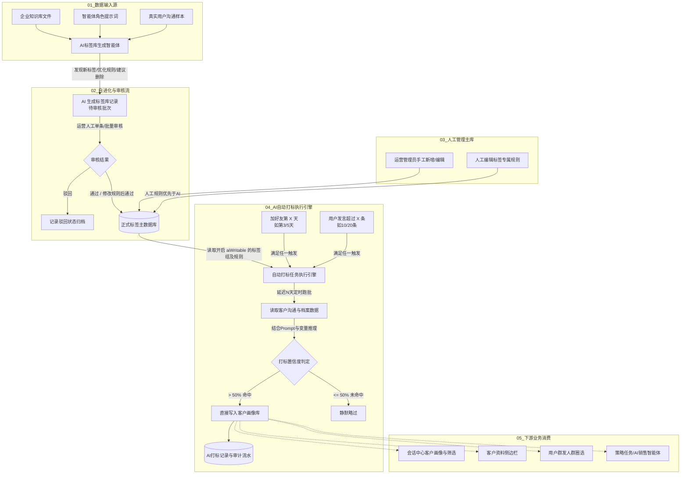

# PRD：标签库管理系统

> **文档版本**：V1.1 (技术就绪版)  
> **更新时间**：2026-09-03  
> **文档状态**：已评审 / 待技术研发排期  
> **适用对象**：前端开发、后端开发、算法/Prompt 工程师、测试团队、产品与运营团队  

---

## 1. 模块定位与业务目标

### 1.1 模块定位
标签库管理系统是“企微智能销售平台”的**用户标签主数据中枢**，承担着全平台客户分层、销售会话画像、AI 接待策略、群发圈选及数据洞察的核心标签治理职责。

本系统突破了传统 CRM 仅靠人工静态维护标签的局限，构建了：
**“人工定义标准 ⇄ AI 深度挖掘自进化提案 ⇄ 人工审核安全合入 ⇄ 批量智能打标与追溯审计”** 的全闭环生命周期。

### 1.2 核心业务目标
1. **建立统一权威的客户标签主数据（Single Source of Truth）**：为会话中心、客户资料抽屉、群发任务、策略任务提供统一口径的标签能力；
2. **AI 自进化降低建库门槛**：让 AI 深度阅读企业知识库、业务智能体提示词与真实用户沟通样本，自主发现高价值候选标签并提炼规则，大幅降低冷启动与维护成本；
3. **严格的质量与合规护栏**：AI 提案必须经过人工审核才可入库；标签严禁涉及医疗诊断或负面定性；
4. **高效全自动打标执行**：根据加好友天数与消息量双轨触发，置信度超过 50% 自动打标入库，释放人工销售 80% 以上的手工打标精力。

---

## 2. 核心架构设计与三大业务准则

### 2.1 三大核心业务准则（评审已定）

| 序号 | 业务准则 | 详细逻辑说明 | 技术实现要求 |
| :--- | :--- | :--- | :--- |
| **01** | **企微官方标签隔离（双向不同步）** | 本系统标签体系为**私有业务销售模型**，与企业微信原生“企业客户标签（Corp Tags）”**物理隔离、双向不同步**。 | **不调用**企微原生打标 API，避免接口频控限制与企业级权限冲突；企微端销售手工打标不自动回流，保障系统纯净度。 |
| **02** | **标签组内平铺多选（暂不设互斥约束）** | 标签组内所有标签均采用**平铺多选**模式，暂不引入组内单选或互斥状态机。 | 客户可同时拥有同一组内的多个标签（如购买意向中可同时存在“价格敏感”与“高意向”），降低规则复杂性。 |
| **03** | **AI 打标置信度 > 50% 自动生效** | AI 自动打标引擎判定置信度（Confidence Score）**大于 50% 时，直接写入客户画像**，无需人工二次确认。 | 无需设计冗长的人工客服“待确认队列”气泡，任务跑批后直接生效并写入打标审计日志；置信度 ≤ 50% 视为未命中。 |

---

### 2.2 系统数据流转全景图



---

## 3. 用户角色与权限矩阵

| 角色 | 业务职责 | 标签库主界面 | AI智能生成抽屉 | 审核记录详情 | 自动打标配置 | 打标记录日志 |
| :--- | :--- | :---: | :---: | :---: | :---: | :---: |
| **运营管理员** | 标签体系第一责任人，审核 AI 建议，全局配置 | 查看/编辑/删除/排序 | 完整配置与发起 | 审核/驳回/修改 | 完整配置与保存 | 查看与下钻 |
| **算法/Prompt 工程师** | 调优大模型 Prompt、字段变量与打标规则 | 查看与微调规则 | 调优 Prompt 模板 | 查看审核趋势 | 调优打标 Prompt | 审计打标准确率 |
| **销售主管 / 班主任主管** | 业务协同方，根据跟进需求提报标签与反馈规则 | 仅查看与建议 | 无权限 | 仅查看 | 无权限 | 查看本部门日志 |
| **普通销售 / 班主任** | 标签使用者，在会话中筛选与查看画像 | 业务界面消费 | 无权限 | 无权限 | 无权限 | 仅看自己客户 |

---

## 4. 详细功能规格说明

### 4.1 模块一：正式标签库管理（主页面）

#### 4.1.1 界面布局与概览
* **页面入口**：导航菜单 `用户运营 -> 标签库管理`；
* **顶部工具栏**：
  * 操作按钮区：【AI智能生成标签】、【AI生成标签库记录】（带待审核红色角标 Badge）、【AI自动打标配置】、【AI打标记录】；
  * 筛选区：部门角色下拉框（全部 / 市场 / 销售 / 班主任）、标签名称/组名关键词搜索输入框、重置按钮；
  * 统计栏：展示系统当前“共 X 个标签”，右侧放置【新增标签组】主操作按钮。

#### 4.1.2 标签组（Tag Group）卡片规格
页面主体以卡片列表形式平铺展示所有标签组：
1. **组头部信息**：
   * **标签组名称**：主标题（如“孩子问题画像”、“购买意向”）；
   * **AI 生成逻辑溯源按钮（AI 蓝色徽标）**：点击弹出弹窗，展示该标签组被 AI 聚类提炼的数据来源（沟通记录、课程行为等）和生成逻辑链条；
   * **标签计数**：展示格式如 `（共 13 个标签）`；
   * **允许 AI 自动打标开关（`aiWritable`）**：Switch 开关，开启后 AI 才能向该组自动写标签；关闭后（如“风险预警”组）AI 只能在日志中给提示，绝对禁止写入客户画像；
   * **组排序与操作**：支持【上移】、【下移】（控制会话中心与侧边栏的展示先后）、【编辑】、【删除】。
2. **组内容区**：
   * **适用部门角色**：展示角色彩色 Tag（如 `销售`、`班主任`、`市场`）；
   * **标签芯片列表（Tag Chip Row）**：
     * 展示所有子标签，带删除图标（`closable`）；
     * **来源标识图标**：👤 表示人工创建；🤖 表示由 AI 生成并审核通过；
     * **规则状态图标**：✏️ 表示人工已修改规则（优先于 AI 规则）；
     * **交互**：点击标签芯片任意区域，直接弹出该标签的【AI 打标规则详情】弹窗。
   * **行内快速添加标签**：
     * `[+ 添加]` 按钮 + 输入框（支持输入文本后回车一键新增）。

#### 4.1.3 新增 / 编辑标签组弹窗
* **弹窗表单字段**：
  * `标签组名称`（必填，文本输入，上限 20 字，组名全局唯一）；
  * `适用部门角色`（必填，多选框，可选：市场 / 销售 / 班主任）；
  * `允许 AI 自动给客户打标签`（布尔开关，默认开启）；
  * `状态`（单选下拉：启用 / 停用，默认启用；停用后历史数据保留，但不出现在业务筛选下拉框中）；
  * `初始标签`（可多选输入，支持回车批量输入初始标签值）。

---

### 4.2 模块二：标签级专属 AI 打标规则（Rule Engine）

#### 4.2.1 规则设计理念
打标规则严格挂载在**具体标签项**维度（而非宽泛的标签组维度）。每个标签具备一套结构化的判断规则。

#### 4.2.2 规则字段规范与编辑弹窗
点击任意标签芯片，弹出规则维护弹窗：
1. **展示元数据**：所属组、标签名、来源（人工/AI）、规则状态（AI规则/人工已改）、生效状态；
2. **规则正文编辑器（Textarea）**：支持运营或算法工程师直接编辑修改规则文本；
3. **标准规则必须包含的 4 要素**：
   * **正向判断条件**：客户出现哪些核心诉求、对话语义或行为模式时打上该标签；
   * **关键词或典型表达样例**：列举 3~5 组代表性真实表达（如“孩子不想去学校”、“别人家孩子改善了吗”）；
   * **排除条件**：明确哪些场景禁止打标（如：偶发单次抱怨、销售诱导提问但客户未确认、属于正常业务询价等）；
   * **置信度建议**：说明高/中/低置信度的区分界限。
4. **仲裁规则**：
   * 一旦用户在弹窗中点击【保存规则】，该标签元数据被标记为 **`人工已改`**；
   * **AI 自动打标引擎在执行时，人工修改后的规则具备绝对最高优先级，自动覆盖 AI 原生规则**。

---

### 4.3 模块三：AI 标签库生成管理智能体（自进化生成）

#### 4.3.1 抽屉式配置控制台
点击页面顶部【AI智能生成标签】，从右侧展开 860px 抽屉：
1. **输入数据范围配置（多选与下钻）**：
   * **企业知识库**：点击【配置】弹窗，勾选已上传的产品大纲、价格方案、业务 SOP 文件；
   * **智能体提示词**：点击【配置】弹窗，勾选现有销售/策略智能体，读取其角色定位与业务边界；
   * **用户沟通数据**：点击【配置】弹窗，可设定筛选规则：
     * “最近 X 个月加的好友”（默认 3 个月）；
     * “用户发出的对话条数超过 X 条”（默认 20 条，过滤低频无效僵尸号）；
     * 支持上传企业对话脱敏文件（支持 `.xlsx`、`.csv`、`.txt`、`.json`）。
2. **适用部门角色**：支持多选指定本批次建议标签适用的业务角色；
3. **生成目标**：多选（`生成标签组`、`生成标签内容`、`生成AI打标规则`）；
4. **提示词高级配置**：展示内置的 Prompt 模板（详见第 5 章）。

#### 4.3.2 标签生成的核心护栏约束（Guardrails）
大模型在分析聚类时，必须严格遵守以下底层约束：
* **去重约束**：与现有标签库语义相似度 ≥ 70% 时，**严禁新增标签**，必须转为“修改标签规则”或“合并建议”；
* **样本量底线**：同一类特征在提取样本中必须由 **≥ 10 个独立用户稳定表达**，少于 10 人视为偶发噪声，不得生成标签；
* **合规红线禁令**：
  * **严禁生成医疗诊断标签**（例如：“抑郁症”、“ADHD”必须合规转换为描述性标签如“情绪低落表达”、“注意力分散表现”）；
  * **严禁生成隐私泄露标签**（真实姓名、住址、学校、身份证号）；
  * **严禁生成负面定性标签**（禁止出现“差生”、“难搞家长”、“问题用户”等）；
  * **禁止替代客观状态字段**（订单已支付、已上课等客观字段走业务状态，不生成为画像标签）。

---

### 4.4 模块四：AI 生成记录与人工审核工作台（审核合入流）

#### 4.4.1 批次管理列表
点击页面顶部【AI生成标签库记录】，弹出批次管理模态框：
* **列表字段**：批次名称（如 `2026-08-26 09:00 AI生成批次`）、生成方式（定时生成 / 手动生成）、待审核变更统计（`新增 X / 修改 Y / 删除 Z`）、状态（待审核 / 已通过）、操作（【查看详情】）。

#### 4.4.2 审核详情工作台（全屏/独立视图）
点击【查看详情】进入沉浸式审核页面：
1. **批次信息摘要卡片**：展示生成时间、触发方式、新增/修改/删除汇总、数据覆盖范围；
2. **批量操作工具栏**：展示“已选择 X 条”，提供【批量通过】与【批量驳回】主操作；
3. **待审核变更明细表格**：
   * **复选框**：支持多选，已完成审核的行置灰禁止重复勾选；
   * **变更类型 Tag**：`新增标签`（蓝色）、`修改标签规则`（橙色）、`建议删除`（红色）；
   * **变更内容**：展示所属标签组及建议标签名称（如 `孩子问题画像 / 返校困难`）；
   * **AI 判断原因**：展示 AI 发现该特征的数据样本依据与业务意义；
   * **AI 打标依据（支持在线微调）**：在表格单元格内以内置 TextArea 形式展示。**审核人员可在通过前直接修改打标规则内容**；
   * **操作列**：单条【通过】、【驳回】。
4. **审核通过的系统联动生效机制**：
   * **新增标签通过**：立即在对应标签组下创建正式标签，规则存入规则库，标签来源打标为“AI生成”；
   * **修改标签规则通过**：用修改后的规则覆盖原标签生效规则，规则状态变更为“人工已改”；
   * **建议删除通过**：将对应标签从正式库软删除（停用），不影响历史打过该标签的用户数据。

---

### 4.5 模块五：AI 自动打标执行引擎与审计日志（业务执行层）

#### 4.5.1 执行配置与触发机制（抽屉）
点击【AI自动打标配置】打开右侧抽屉：
1. **基础开关与角色范围**：
   * `启用自动打标`（Switch 开关，全局主控）；
   * `角色选择`（多选：销售 / 班主任）。
2. **执行对象双轨触发规则（OR 关系，满足任一即可）**：
   * **规则 A：加好友第 X 天**：支持配置多个时间节点（如配置 `3`、`5`，代表加好友第 3 天跑一次、第 5 天再跑一次）；
   * **规则 B：用户发出消息条数超过 X 条**：支持配置多个发言阶梯（如配置 `10`、`20`，代表达到 10 条打一次、达到 20 条再打一次）。
3. **延迟跑批执行时间**：
   * `满足以上条件自然日后`：下拉可选（`后 1 天`、`后 2 天`、`后 3 天`）；
   * `执行时间`：时间输入（如 `00:00`，利用夜间离线资源批量执行）。
4. **数据来源授权与变量清单**：
   * 自动打标默认授权读取：**用户沟通数据** + **客户档案数据**；
   * 支持在线勾选具体传入大模型的系统变量字段（如 `conversation.user_messages`、`profile.child_grade`、`profile.core_problem` 等）。

#### 4.5.2 AI 打标执行与判定准则
* **打标范围限定**：引擎扫描时，**严格仅处理 `aiWritable === true`（允许 AI 自动打标）的标签组**；
* **打标依据优先序**：逐一根据标签库生效规则判断，**人工修改过的规则绝对优先于 AI 原生规则**；
* **置信度判定机制（核心准则）**：
  * 大模型在推理分析后，输出打标决策与置信度打分 $C \in [0, 100\%]$；
  * **当 $C > 50\%$ 时**：系统判定结论可靠，**直接执行写入数据库**，增加或更新该客户的画像标签，**无需人工二次确认**；
  * **当 $C \le 50\%$ 时**：系统判定置信度不足或证据不充分，**放弃打标**，不写入客户画像。

#### 4.5.3 打标记录与下钻审计（日志弹窗）
点击【AI打标记录】打开模态框，提供完整的打标审计跟踪：
1. **批次流水表**：展示打标批次号、执行方式（定时/手动）、扫描用户数、新增标签数、移除标签数、修改标签数；
2. **批次详情下钻表（Detail Modal）**：
   * **打标对象**：客户名称（如“张妈妈”）；
   * **角色**：销售 / 班主任；
   * **操作类型**：新增（绿 Tag）/ 删除（红 Tag）/ 修改（蓝 Tag）；
   * **标签名**：命中的标签名称；
   * **打标原因**：记录大模型输出的打标证据摘录与推导链（例如：“最近对话中主动询问班型安排，符合高意向规则”）；
   * **业务跳转闭环**：每行提供【查看用户标签】链接，**点击后直接关闭弹窗并跳转定位到会话中心对应的客户**，方便销售或管理层复核。

---

## 5. 大模型 Prompt 规范与输出约束

### 5.1 标签生成智能体 Prompt 规范（节选核心系统指令）

```markdown
# 角色定位
你是“AI标签库生成管理智能体”，负责分析青少年心理与家庭教育沟通场景，挖掘高价值标签与规则。

# 输入数据
仅限读取已授权的知识库文档、提示词与用户会话抽样。

# 核心业务约束
1. 最小独立用户样本数：同一特征必须在 >= 10 个独立用户的对话中稳定复现，禁止基于单条偶然对话生成标签。
2. 语义查重：与现有标签库语义重合度 >= 70% 时，严禁新增，应输出修改规则或合并建议。
3. 医疗与合规禁令：禁止诊断性词汇（如抑郁症、多动症），必须转换为行为观察描述（如情绪低落表达、注意力分散表现）；严禁负面定性与隐私信息。
4. 正式库隔离：你的输出全部为“候选变更”，必须经由人工审核通过后方可入库。

# 输出结构要求 (JSON)
{
  "summary": { "newTags": 3, "modified": 1, "deleted": 0 },
  "changes": [
    {
      "type": "新增标签 | 修改标签规则 | 建议删除",
      "groupName": "所属标签组",
      "tagName": "标签名称",
      "aiSuggestion": "挖掘归因与样本依据说明",
      "ruleText": "包含正向判断条件、排除条件与证据样例的打标规则",
      "sampleCount": 12
    }
  ]
}
```

---

## 6. 数据模型设计建议（DDL 参考）

### 6.1 标签组表（`tag_group`）
```sql
CREATE TABLE `tag_group` (
  `id` varchar(64) NOT NULL COMMENT '标签组唯一ID',
  `name` varchar(64) NOT NULL COMMENT '标签组名称',
  `roles` json NOT NULL COMMENT '适用部门角色列表 ["市场","销售","班主任"]',
  `ai_writable` tinyint(1) NOT NULL DEFAULT 1 COMMENT '是否允许AI自动打标: 1-允许, 0-禁止',
  `status` varchar(16) NOT NULL DEFAULT 'enabled' COMMENT '状态: enabled-启用, disabled-停用',
  `sort_order` int NOT NULL DEFAULT 0 COMMENT '展示排序序号',
  `ai_reason` json DEFAULT NULL COMMENT 'AI生成溯源与逻辑链',
  `created_by` varchar(64) DEFAULT NULL COMMENT '创建人',
  `created_at` datetime NOT NULL DEFAULT CURRENT_TIMESTAMP,
  `updated_at` datetime NOT NULL DEFAULT CURRENT_TIMESTAMP ON UPDATE CURRENT_TIMESTAMP,
  PRIMARY KEY (`id`),
  UNIQUE KEY `uk_name` (`name`)
) ENGINE=InnoDB DEFAULT CHARSET=utf8mb4 COMMENT='标签组主表';
```

### 6.2 标签项与规则表（`tag_item` & `tag_rule`）
```sql
CREATE TABLE `tag_item` (
  `id` varchar(64) NOT NULL COMMENT '标签唯一ID',
  `group_id` varchar(64) NOT NULL COMMENT '所属标签组ID',
  `name` varchar(64) NOT NULL COMMENT '标签名称',
  `source` varchar(16) NOT NULL DEFAULT 'manual' COMMENT '来源: manual-人工新增, ai_generated-AI生成',
  `rule_status` varchar(16) NOT NULL DEFAULT 'ai' COMMENT '规则状态: ai-AI生成规则, manual_edited-人工已改',
  `status` varchar(16) NOT NULL DEFAULT 'enabled' COMMENT '状态: enabled-启用, disabled-停用',
  `current_rule_id` varchar(64) DEFAULT NULL COMMENT '当前生效的规则ID',
  `created_at` datetime NOT NULL DEFAULT CURRENT_TIMESTAMP,
  `updated_at` datetime NOT NULL DEFAULT CURRENT_TIMESTAMP ON UPDATE CURRENT_TIMESTAMP,
  PRIMARY KEY (`id`),
  UNIQUE KEY `uk_group_tag` (`group_id`, `name`)
) ENGINE=InnoDB DEFAULT CHARSET=utf8mb4 COMMENT='标签项主表';

CREATE TABLE `tag_rule` (
  `id` varchar(64) NOT NULL COMMENT '规则唯一ID',
  `tag_id` varchar(64) NOT NULL COMMENT '关联标签ID',
  `rule_text` text NOT NULL COMMENT 'AI打标规则正文',
  `source` varchar(16) NOT NULL COMMENT '规则来源: ai / manual',
  `is_current` tinyint(1) NOT NULL DEFAULT 1 COMMENT '是否当前生效',
  `version` int NOT NULL DEFAULT 1 COMMENT '版本号',
  `created_by` varchar(64) DEFAULT NULL COMMENT '创建/修改人',
  `created_at` datetime NOT NULL DEFAULT CURRENT_TIMESTAMP,
  PRIMARY KEY (`id`),
  KEY `idx_tag_current` (`tag_id`, `is_current`)
) ENGINE=InnoDB DEFAULT CHARSET=utf8mb4 COMMENT='标签规则版本表';
```

### 6.3 客户打标审计日志表（`customer_tag_log`）
```sql
CREATE TABLE `customer_tag_log` (
  `id` bigint NOT NULL AUTO_INCREMENT COMMENT '自增主键',
  `batch_no` varchar(64) NOT NULL COMMENT '打标批次号',
  `customer_id` varchar(64) NOT NULL COMMENT '客户ID',
  `customer_name` varchar(64) DEFAULT NULL COMMENT '客户姓名快照',
  `role` varchar(32) NOT NULL COMMENT '执行业务角色: 销售/班主任',
  `operation` varchar(16) NOT NULL COMMENT '操作类型: 新增 / 删除 / 修改',
  `tag_id` varchar(64) NOT NULL COMMENT '标签ID',
  `tag_name` varchar(64) NOT NULL COMMENT '标签名称快照',
  `confidence` decimal(5,2) NOT NULL COMMENT 'AI置信度百分比(如 85.50)',
  `reason` text NOT NULL COMMENT 'AI判断原因与证据摘要',
  `executed_at` datetime NOT NULL DEFAULT CURRENT_TIMESTAMP COMMENT '执行时间',
  PRIMARY KEY (`id`),
  KEY `idx_batch` (`batch_no`),
  KEY `idx_customer` (`customer_id`)
) ENGINE=InnoDB DEFAULT CHARSET=utf8mb4 COMMENT='AI自动打标审计明细表';
```

---

## 7. 异常处理与边界场景

| 场景分类 | 异常/边界条件 | 预期系统响应行为 |
| :--- | :--- | :--- |
| **标签删除拦截** | 运营尝试删除已被客户打上的历史标签 | 系统**禁止物理删除**，强制引导进行“停用”。停用后不出现在业务打标列表，但保留客户历史数据追溯。 |
| **打标并发冲突** | 销售正在手动给客户打标的同时，后台 AI 自动打标任务也在跑批 | **人工打标优先**。若发生并发写入，数据库以人工保存版本为准，AI 任务检测到近期人工打标记录则跳过自动覆盖。 |
| **离线跑批重试** | 凌晨批量打标时，大模型接口超时或限流报错 | 引擎引入指数退避重试（重试 3 次）。若重试失败，记录批次异常状态并通知管理员，不污染未完成判定的用户画像。 |
| **高危敏感词拦截** | 用户对话中出现自残、伤人等严重危机词汇 | **立即熔断自动打标**，严禁生成或写入任何普通营销标签；单独触发系统风控报警，强行推送人工客服介入。 |
| **组内同名防护** | 人工新建或 AI 审核入库同名标签 | 数据库及前端校验均做同组唯一性拦截，提示“该标签组下已存在同名标签”。 |

---

## 8. 交付验收标准 (DoD)

1. **正式标签库体验**：
   - 标签组的新增、编辑、删除、上移、下移正常生效，前端与数据库一致；
   - 部门角色筛选与关键词检索响应时间 `< 200ms`；
   - 每个标签点击后能正常查看并保存打标规则，保存后芯片立即展示“人工已改”图标。
2. **AI 生成与审核闭环**：
   - 能够基于已选数据源成功调用大模型生成候选变更批次；
   - 审核人员能在审核表格中直接修改“AI 打标依据”并批量通过；
   - 审核通过后，正式库中立刻出现对应的新增标签或更新后的规则。
3. **AI 自动打标执行与审计**：
   - 满足“加好友天数”或“消息条数”触发条件的用户能准时被调度引擎扫描；
   - **当判定置信度 $> 50\%$ 时，成功自动给客户打上标签**，无需人工确认；
   - 在打标日志详情中点击【查看用户标签】，能够无缝跳转至会话中心对应客户聊天界面。
